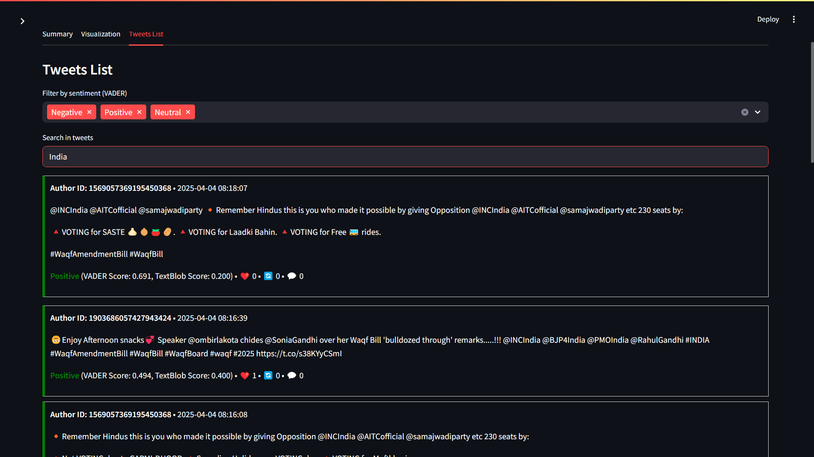

# Real-Time Twitter Sentiment Analysis

## Live Demo

Check out the deployed version of the app: [Live Demo](https://realtime-twitter-sentiment-mcmal5dugzzahzao34dpvh.streamlit.app)

This is a **Streamlit-based web app** for real-time sentiment analysis of tweets using **Twitter API v2**. The app fetches tweets based on user-input keywords and performs sentiment analysis using **a custom sentiment analysis model** *(previously used VADER and TextBlob)*. It also provides interactive visualizations and allows downloading the analyzed data.

## Features

- **Fetch live tweets** based on a keyword using Twitter API v2
- **Sentiment analysis** using a custom-built sentiment analysis model *(Previously used VADER and TextBlob)*
- **Interactive visualizations** (Pie Charts, Histograms, Metrics)
- **Filter and search tweets** based on sentiment
- **Download results** as a CSV file

## Installation & Usage

### Clone the Repository

```bash
git clone https://github.com/ShauryaDusht/realtime-twitter-sentiment.git
cd realtime-twitter-sentiment
```

### Create a Virtual Environment (Recommended)

```bash
python -m venv venv
source venv/bin/activate  # On macOS/Linux
venv\Scripts\activate    # On Windows
```

### Install Dependencies

Ensure you have Python installed, then run:

```bash
pip install -r requirements.txt
```

### Set Up Twitter API Credentials

Get your **Bearer Token** from [Twitter Developer Portal](https://developer.twitter.com/). Add it when prompted in the app.

### Run the Streamlit App

```bash
streamlit run app.py
```

## Tech Stack

- **Frontend**: Streamlit
- **Backend**: Tweepy (Twitter API v2), NLTK, Custom Sentiment Analysis Model *(Previously used VADER and TextBlob)*
- **Visualization**: Plotly, Pandas

## Screenshots

Here are some screenshots of the app in action:





